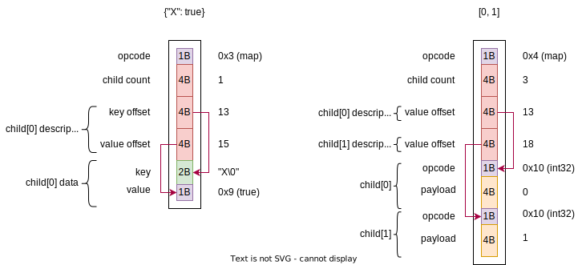

# SBSON #
**SBSON** (Seekable [BSON](https://bsonspec.org/)) is a JSON-esque binary format that aims to be easily seeked without deserialization.
This enables querying specific parts of a large document without deserializing all of it, by having a "Cursor" that moves up and down the document tree.

This repository contains a reference implementation in Python, a Rust implementation of the cursor, and Python bindings for the cursor.

## Design ##
The [spec](./spec.md) defines the object layout in a "formal" way. (if you're into that sort of thing)

An SBSON node is one of:
 - Map: A mapping between string keys to other nodes
 - Array: A collection of unnamed nodes, accessible by index.
 - Leaf: A primitve value (e.g. integers, strings, booleans)

All nodes start with a 1 byte element-type code.
SBSON maps and arrays follow that with the number of children and a header block containing that number of child "descriptors".

Array descriptors are a single uint32_t containing the offset of the element starting from the array's opcode.
Map descriptors are a tuple of 2 uint32_t's, containings the offsets of the key and of the value.

A map with multiple children will have the keys sorted before serialization, so that keying into the map without deserializing the descriptors can be done in `O(log n)` by performing a binary search.